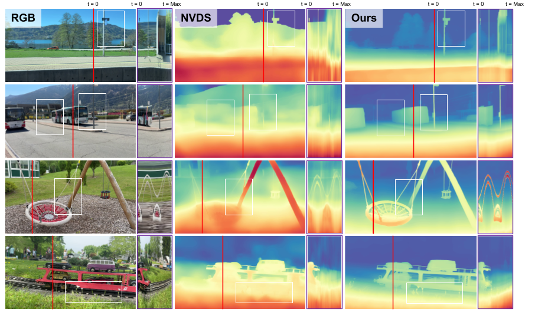

<div align="center">
<h1>VDPP: Video Depth Post-Processing for Speed and Scalability</h1>
<p>
Daewon Yoon<sup>1,2,*</sup> &nbsp;
Injun Baek<sup>1,2,*</sup> &nbsp;
Sangyu Han<sup>1</sup> &nbsp;
Yearim Kim<sup>1</sup> &nbsp;
Nojun Kwak<sup>1,†</sup>
</p>
<p>
<sup>1</sup> Seoul National University &nbsp;&nbsp;
<sup>2</sup> Samsung Electronics
</p>
<p>
<sup>*</sup> Equal contribution &nbsp;&nbsp;
<sup>†</sup> Corresponding author
</p>
<a href=""></a>
</div>

&nbsp;

<p align="center">
🎯 <b>Depth-Only Input</b> &nbsp;&nbsp;&nbsp; ⚡ <b>Lightweight</b> &nbsp;&nbsp;&nbsp; 🔌 <b>Plug-and-Play</b>
</p>

<p align="center">
  
</p>

Per-frame depth estimation models (e.g., [Depth-Anything-V2](https://github.com/DepthAnything/Depth-Anything-V2), [DPT](https://github.com/isl-org/DPT)) are fast but produce **temporally inconsistent** results with noticeable flickering across frames. **VDPP** is a lightweight post-processing model that refines these per-frame depth maps into temporally consistent video depth. It takes only depth maps as input and works as a plug-and-play module on top of any image-to-depth model.

---

## News
- **2026-03-26**: Code and models released.
- **2026-03-25**: Paper accepted at [CVPR 2026 ECV Workshop](https://ecv-workshop.github.io/).


## Pre-trained Models

We provide the VDPP model for robust and consistent video depth estimation.  

| Model                                 | Params   | Checkpoint   |
|---------------------------------------|---------:|:------------:|
| VDPP            | 111M    | [Download](https://github.com/injun-baek/VDPP/releases/download/v1.0/vdpp.pth) |

## Usage

> **Tested on:** Python 3.10, CUDA 12.6

### Download Pretrained Models
Download the checkpoints listed [above](#pre-trained-models) and place them in the `checkpoints` directory.

```bash
wget https://github.com/injun-baek/VDPP/releases/download/v1.0/vdpp.pth -O checkpoints/vdpp.pth
```

### Download Image-to-Depth Models
You will also need the Image-to-Depth model; our sample uses Depth-Anything-V2, but any compatible Image-to-Depth model should work as well.
Please refer to the [official repository](https://github.com/DepthAnything/Depth-Anything-V2) or run the script below to download the pretrained model:

```bash
wget https://huggingface.co/depth-anything/Depth-Anything-V2-Large/resolve/main/depth_anything_v2_vits.pth
wget https://huggingface.co/depth-anything/Depth-Anything-V2-Large/resolve/main/depth_anything_v2_vitb.pth
wget https://huggingface.co/depth-anything/Depth-Anything-V2-Large/resolve/main/depth_anything_v2_vitl.pth
```

### Running Script on Video
```bash
python run_video.py \
  --indir <path> \
  --outdir <outdir> \
  --checkpoint <checkpoint_path> \
  [--dav2_model {vits,vitb,vitl,vitg}] \
  [--input-size <size>] \
  [--downsize] \
  [--grayscale]
```

- `--indir`: Input directory or video file.
- `--outdir`: Output directory for saving results.
- `--checkpoint`: Path to the downloaded VDPP checkpoint.
- `--dav2_model`: Which Depth-Anything-V2 image-to-depth model to use (default `vitl`).
- `--input-size`: (Optional) Input size for inference; defaults to the smaller of width/height.
- `--downsize`: (Optional) Downsize inference frames before VDPP for faster throughput (default False).
- `--grayscale`: (Optional) Save the grayscale depth map instead of applying a colormap.

#### Examples
```bash
python run_video.py \
  --indir assets/SVD/0082.mp4 \
  --outdir ./results/ \
  --checkpoint ./checkpoints/vdpp.pth
```
```bash
python run_video.py \
  --indir assets/SVD/ \
  --outdir ./results/ \
  --checkpoint ./checkpoints/vdpp.pth
```

## Acknowledgements
This repository includes a video from the [SVD: Spatial Video Dataset](https://cd-athena.github.io/SVD/).

## License
The VDPP model is released under the Apache-2.0 license.
For the Image-to-Depth model (Depth-Anything-V2) used in this code, please refer to its [repository](https://github.com/DepthAnything/Video-Depth-Anything).

## Citation
If you find this project useful, please consider citing:
```bibtex
@inproceedings{yoon2026vdpp,
  title={VDPP: Video Depth Post-Processing for Speed and Scalability},
  author={Yoon, Daewon and Baek, Injun and Han, Sangyu and Kim, Yearim and Kwak, Nojun},
  booktitle={Proceedings of the IEEE/CVF Conference on Computer Vision and Pattern Recognition (CVPR) Workshops},
  year={2026}
}
```
